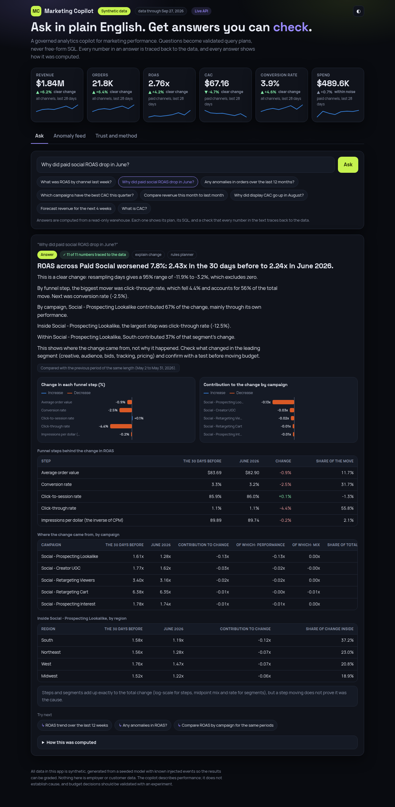
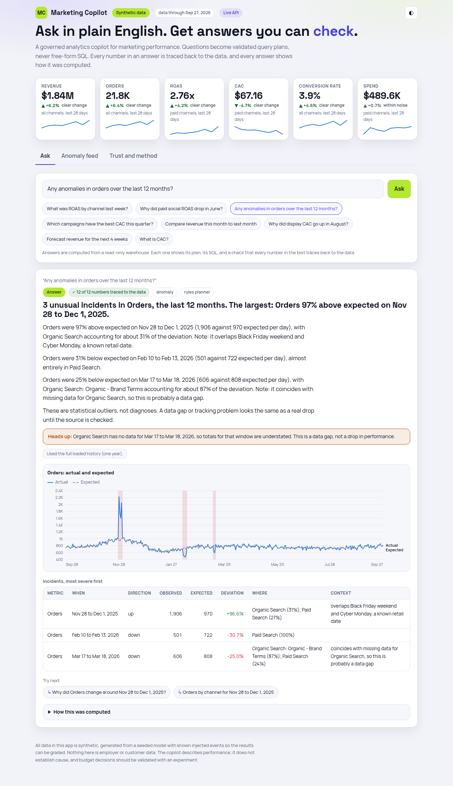
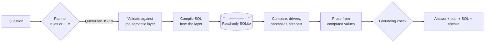

# Marketing Copilot

**Ask a marketing-performance question in plain English and get an answer you can check.**
Questions become validated query plans (never free-form SQL), every number in the answer is traced back to
the data, and every answer shows its plan, its SQL and its assumptions. Python, FastAPI, SQL, statsmodels and
scikit-learn on the back end; React and TypeScript on the front.

> **Read this first: the data is synthetic.**
> A seeded generator builds a year of daily results for 20 campaigns across five channels and four regions
> (29,176 rows), then injects six known events: a tracking break, creative fatigue, a Black Friday peak, CPM
> inflation, a one-day pacing bug, and a two-day ingestion gap. Because the truth is known, the copilot can be
> graded on whether it finds each one unprompted. Nothing here is employer or customer data, and the numbers
> describe how the methods behave, not how any real business performs.



## What it does

| Ask | What happens |
|---|---|
| "What was ROAS by channel last week?" | A governed query, ranked, with a chart and a comparison with the previous period that says whether the change is more than normal noise |
| "Why did paid social ROAS drop in June?" | An exact decomposition into funnel steps (click-through rate fell 4.4%, 56% of the move) and into campaigns (one campaign carries 67%), then a drill-down into that campaign |
| "Any anomalies in orders over the last 12 months?" | Incidents with expected versus observed values, localised to a channel or campaign, with known retail dates labelled and data gaps called out as gaps |
| "Forecast revenue for the next 4 weeks" | A backtested forecast with an empirical band and an explicit warning if the window reaches a holiday it cannot anticipate |
| "What is CAC?" | A curated definition retrieved from the semantic layer, with its formula and a "watch out" note |
| "What was our profit?" | A refusal with the reason (no costs in the warehouse), not a plausible-looking guess |



## Measured results

Run with `python -m mktg_copilot eval --check`; CI fails if a gate regresses. Full report: [`reports/eval.md`](reports/eval.md), method and caveats: [`docs/evaluation.md`](docs/evaluation.md).

| Check | Result |
|---|---|
| Numbers versus an independent pandas oracle | **67 of 67** answers match |
| Every number in the prose traced to a computed value | **460 of 460** (98 answers) |
| Injected events found without being told | **6 of 6**, with the right channel or campaign |
| Refusals, clarifications and injection safety | **24 of 24**; warehouse unchanged |
| False incidents on event-free data | **0.14** per series per year (a plain 4-sigma rule gave about 18) |
| Forecast, latest 28 days | 3.8% mean error against 6.9% for repeating last week |
| Plan accuracy | 100% on 58 dev and 40 held-out questions. **The held-out set scored 82.5% on its first run**; the failures were fixed, so it is no longer a blind test |
| Tests | 218 pytest, 7 vitest; type-checked front end |

## How an answer is made



Design choices worth knowing (details in [`docs/architecture.md`](docs/architecture.md)):

* **The planner chooses what to ask; it never writes SQL or numbers.** The plan is data, checked against a semantic layer that defines every KPI once ([`docs/metrics.md`](docs/metrics.md)). Values are bound parameters and the connection is read-only.
* **Ratios are ratios of sums.** ROAS for a week is total revenue over total spend, never an average of daily ROAS.
* **Exact explanations.** Funnel steps add up on a log scale; segment effects split into mix and rate and add up to the total. Both are tested on random data.
* **Noise is named.** Every comparison is bootstrapped over days and labelled "clear change" or "within normal noise".
* **Silence is not an answer.** Unknown regions, platforms, breakdowns and out-of-range years are asked about or refused, never ignored.
* **Correlation stays correlation.** Answers say where a change came from, not why, and the verifier flags causal wording.

## Run it

```bash
python -m venv .venv && source .venv/bin/activate
pip install -r requirements.txt
PYTHONPATH=src python -m pytest -q                     # 218 tests, about 25 seconds
PYTHONPATH=src python -m mktg_copilot ask "Why did display CAC go up in August?" --sql
PYTHONPATH=src python -m mktg_copilot eval --check     # evaluation and quality gates

cd frontend && npm ci && npm run build && cd ..        # the React app
PYTHONPATH=src python -m mktg_copilot serve            # http://127.0.0.1:8000 (API and UI)
```

For front-end development run `npm run dev` in `frontend/` (port 5173, proxied to the API). With Docker:
`docker compose up --build`. The warehouse is generated on first start (about two seconds).

**Recorded demo.** `npm run build:demo` builds a static version that replays 25 answers recorded from the real
engine, including refusals. It needs no server and is what GitHub Pages hosts; free-text questions need the API.
Regenerate the recording with `python -m mktg_copilot export-demo`.

**Optional LLM planner.** Set `COPILOT_LLM_API_KEY` (plus `COPILOT_LLM_BASE_URL` and `COPILOT_LLM_MODEL` for a
compatible endpoint) and the planner can be switched to a model. It sees the catalog's vocabulary and retrieved
definitions, never data, and its reply goes through the same schema and allowlist. This path is tested against a
stub server, not a live model.

## What is in the box

| Path | What it does |
|---|---|
| `src/mktg_copilot/metrics.yaml`, `semantic.py` | The semantic layer and the SQL compiler |
| `src/mktg_copilot/nlu/` | Time parser, rule-based planner, optional LLM planner, TF-IDF retrieval |
| `src/mktg_copilot/analysis/` | Decomposition, bootstrap, anomalies, forecast |
| `src/mktg_copilot/engine.py`, `verify.py` | Orchestration and the grounding verifier |
| `src/mktg_copilot/api/` | FastAPI service |
| `src/mktg_copilot/evals/` | Oracle, question sets, runner, demo recorder |
| `frontend/` | React and TypeScript app with hand-built SVG charts (crosshair tooltips, keyboard control) |
| `tests/` | 218 tests across data, SQL, parsing, planning, maths, safety, API and the evaluation gates |

## Limitations

* **Synthetic data.** Real data adds promotions, returns, tracking drift and holidays the generator does not model, and the anomaly thresholds would need recalibrating.
* **The planner is rules.** It covers the question styles in the test sets; unfamiliar phrasing gets a clarification, which is the safe failure. The LLM planner is there for breadth and is untested against a live model.
* **Descriptive, not causal.** There is no attribution or incrementality in this warehouse (see [Project-1](https://github.com/sridhareddy02/Project-1) for that), so answers locate changes but do not explain them.
* **One year of history.** Annual seasonality cannot be learned; forecasts are limited to eight weeks and ratios are not forecast.
* **Channel-level facts only.** No customers, no platforms, no costs beyond media spend.
* **Docker files are written but were not built in the environment this was developed in.**

## Skills this project demonstrates

SQL and a governed semantic layer, Python, Pandas and NumPy, statistical analysis (bootstrap, decomposition), anomaly detection and forecasting with statsmodels, retrieval with scikit-learn, FastAPI and pydantic structured-output validation, LLM integration with safety validation, React, evaluation design, KPI definition and data validation, automated testing and CI.
