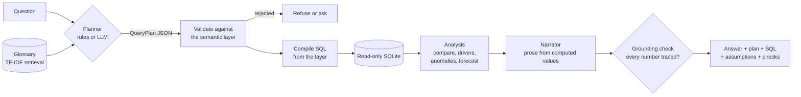

# Architecture

## The idea

Most "chat with your data" tools let a language model write SQL and then narrate whatever comes back. That is
fast to build and hard to trust: the model can invent a metric, join the wrong tables, or state a number the
query never returned. This project takes the opposite position. **The model, or the rule-based planner, only
chooses *what* to ask. It never writes SQL and never writes numbers.**

## Layers

| Layer | File | Responsibility |
|---|---|---|
| Data | `data/spec.py`, `generate.py`, `warehouse.py` | A seeded synthetic warehouse (20 campaigns, 5 channels, 4 regions, 365 days, 29,176 rows) with six injected events; a star schema in SQLite opened read-only |
| Semantic layer | `metrics.yaml`, `semantic.py` | Every metric, dimension, funnel chain and refusal reason, defined once. The compiler can only emit SQL from these names, and every value is a bound parameter |
| Contracts | `plan.py` | Pydantic models for the plan and the answer. A plan is data; unknown fields are dropped |
| Understanding | `nlu/` | Time-expression parser, rule-based planner, optional LLM planner, TF-IDF retrieval over definitions |
| Validation | `validate.py` | The allowlist every plan passes, whoever proposed it |
| Analysis | `analysis/` | Exact driver decomposition, bootstrap noise test, anomaly detection, calibrated forecasting |
| Answering | `engine.py`, `verify.py` | Orchestration, prose from computed values, the grounding verifier |
| Service | `api/app.py` | FastAPI: `/api/ask`, `/api/overview`, `/api/anomalies`, `/api/catalog`, `/api/eval` |
| Interface | `frontend/` | React and TypeScript: charts drawn as SVG with crosshair tooltips, keyboard control and a data table for every answer |
| Quality | `evals/`, `tests/` | An oracle, three question sets, injected-event recovery, false-alarm measurement, 218 tests |

## Safety properties, and what enforces each

| Property | Enforced by | Tested in |
|---|---|---|
| No free-form SQL | The planner emits a plan, not SQL; the compiler takes identifiers only from the YAML | `test_semantic.py::test_compiler_rejects_unknown_names` |
| Values cannot inject | All values are bound parameters | `test_values_are_bound_parameters_never_interpolated` |
| Warehouse cannot be modified | `mode=ro` connection and `PRAGMA query_only` | `test_connection_is_read_only` |
| An LLM cannot smuggle SQL | Plan schema ignores unknown keys; same allowlist as the rules | `test_llm.py::test_smuggled_sql_field_is_dropped_and_never_executed` |
| Unknown things are not silently ignored | Unknown region, channel, platform, breakdown, or year-out-of-range asks or refuses | `test_planner.py::test_unknown_entities_are_not_ignored` |
| Spend metrics are not diluted by owned channels | Paid-only scoping, stated in the answer | `test_engine.py::test_mixed_owned_and_paid_scope_drops_the_owned_channel` |
| Every number in the prose is real | The verifier traces each number to a computed value | `test_verify.py`, `test_tampering_with_the_narrative_is_caught` |
| No causal claims from a dashboard | The verifier flags causal wording; answers say "where", not "why" | `test_flags_causal_language` |

## Driver analysis, exactly

For a ratio metric such as ROAS, the funnel telescopes:

`ROAS = (revenue/orders) x (orders/sessions) x (sessions/clicks) x (clicks/impressions) x (impressions/spend)`

On a log scale the change in ROAS is the sum of the changes in the five factors, so the share each factor
contributes is exact (log-mean Divisia, "LMDI"). Separately, ROAS across segments is `sum(weight x rate)` with
weight equal to the segment's share of spend. Each segment's change splits at the midpoint into a **mix** effect
(budget moved) and a **rate** effect (the segment got better or worse), and the pieces add back to the total
change. Both identities are tested on randomised data, including a segment that disappears between periods.

Splitting click-through rate from CPM matters: it is what separates creative fatigue (CTR falls) from auction
pressure (CPM rises), and the evaluation checks that the copilot tells the two apart.

## Noise versus change

A change in a metric is compared with ordinary day-to-day variation by resampling whole days (1,000 draws) and
reporting a 95% range. "Within normal noise" means the range includes zero. The bootstrap takes the baseline
first and the current period second; swapping them flips every sign, and a regression test pins that down
because it was a real bug during development.

## Anomalies, and why the rule has two parts

Each daily series is decomposed (STL, weekly period, robust fit) and the residual is scored with a
median-absolute-deviation z. A plain 4-sigma rule raised about 18 false incidents per series per year on
event-free data because the residuals have heavy tails. A day is therefore flagged only if it has a robust z of
at least 8 **and** is at least 15% away from expected. That cut false incidents on clean data (a different
seed) to about 0.14 per series-year while every injected event, whose z-scores run from 13 to 104, is still
caught. Consecutive flagged days merge into one incident, which is then localised to a channel and, when one
channel carries most of it, to a campaign.

## Forecasting

Exponential smoothing with damped trend and a weekly pattern. The model's own prediction intervals were far
too wide on this data (100% coverage of an 80% interval), so the band is empirical: the model is refitted at
33 past origins and the spread of actual/forecast ratios at the same horizon sets the 10th to 90th percentile.
The most recent 28 days are forecast from the data before them and scored against a repeat-last-week baseline
(3.8% against 6.9% mean absolute percentage error). With one year of history the model cannot learn annual
seasonality, so a window that reaches Black Friday carries a warning.

## The optional LLM planner

Set `COPILOT_LLM_API_KEY` (and optionally `COPILOT_LLM_BASE_URL`, `COPILOT_LLM_MODEL`) and an
OpenAI-compatible chat model may propose the plan. It is given the catalog's vocabulary and retrieved
definitions, never the data. Its JSON reply goes through the same pydantic schema and the same allowlist as a
rule-based plan; an invalid reply is retried once with the error and then replaced by the rule-based plan, with
a note on the answer. **This path is tested against a stub HTTP server, not a live model.** The rules planner
is the default and what the reported evaluation measures.
